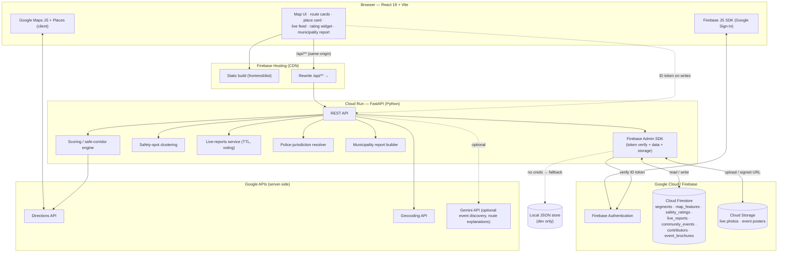

# SafeRoute — Community‑Powered Safe Navigation for Kochi

## 1. Project description

SafeRoute is a Google‑Maps‑style web application for Kochi that ranks routes and
places by **how safe they are**, not just how fast. It fuses a transparent,
explainable scoring model with live, location‑tagged input from the people who
actually use the streets.

**Core capabilities**

- **Safe‑corridor routing.** For a trip, SafeRoute pulls Google Directions
  alternatives and re‑ranks them by a 0–100 **safety score** computed per road
  segment from lighting, foot traffic, police proximity, recent incident
  history, road condition and flood risk — weighted and adjusted for time of day
  (night lowers the foot‑traffic contribution). Verified community hazard reports
  that lie on a route's path subtract points, and the route card shows *what*
  and *where*.

- **Community map contributions.** Signed‑in users drop points — working /
  broken / missing streetlights, potholes, dark areas, unsafe spots, CCTV,
  police aid posts. Each point carries an **append‑only lifecycle log**
  (reported → confirmed → repaired → reappeared), a **severity** (1–3), a
  **recurrence count** (how many times it broke again after a fix), and a
  **per‑post anonymity toggle** (the account is always recorded server‑side; only
  the displayed name is hidden). Points are editable, and a fixed pothole/light
  can be re‑opened ("it's back").

- **Safety ratings & "safety spots".** A subjective *"how safe does this feel?"*
  1–5 rating, with tags (poor lighting, isolated, harassment risk, …) and a
  comment. Ratings within ~75 m **cluster into a stable "spot"**, one rating per
  person per spot. The spot's consensus applies a **bounded (±15), time‑decayed**
  nudge to the computed safety score — shown *next to* the algorithmic number,
  never replacing it, and only once there are enough ratings.

- **Live "happening now" layer.** Short‑lived, geo‑tagged reports:
  *alerts* (flooding, accident, road blocked, protest / crowd, police activity,
  harassment, hazard, power cut) and *vibes* (street food, live music, festival,
  market, good view, screening). Each has a category TTL (2–8 h), auto‑expires,
  can carry a **photo**, and supports **"still here" / "not anymore" voting** and
  a comment thread. The feed is **distance‑scoped** ("within 1 / 3 / 10 km /
  everywhere"); alerts on a planned route are flagged on the route card.

- **Police jurisdiction.** From a curated Ernakulam registry, SafeRoute shows
  both the **nearest** station and the station whose **mapped jurisdiction
  actually contains** the point (deepest‑containment tie‑break over overlapping
  boundary rectangles), with a Directions link.

- **Municipality report.** A three‑tab operational report — **Lighting**,
  **Potholes**, **Safety & patrolling** — that answers "where to send a repair
  crew" and "where to step up patrolling". Chronic, repeatedly‑recurring
  potholes float to the top. One‑click **CSV export**.

- **Assistance.** An SOS panel with emergency numbers and the covering police
  station; a place card with a Google‑Maps‑style header (rating, hours, photo,
  Call / Website / Directions) and a **"Nearby help"** tab — hospitals (filtered
  to real hospitals, not clinics), petrol pumps, vehicle repair, ATM — each with
  distance and Directions.

**Identity.** Firebase Authentication with Google Sign‑In. Contributions are
tied to a real account; anonymity is a display choice, not an identity gap.

**Graceful degradation.** With no Firebase credentials the app runs end‑to‑end
on a local JSON store with a lightweight "dev name" identity, so development and
demos never depend on the cloud.

---

## 2. Project use case

**Who it's for:** residents, daily commuters, women travelling alone,
night‑shift workers and tourists in Kochi who need to decide *how* to get
somewhere safely — and local bodies who need a prioritised list of what to fix.

**Representative scenarios**

| Situation | What SafeRoute does |
|---|---|
| *"It's 10 pm, I'm walking from Ernakulam station to Kaloor — which way is better lit and busier?"* | Ranks Google's route alternatives by night safety score, flags a dark segment and a rating spot where several people reported feeling unsafe, and offers the safer corridor. |
| *"MG Road is flooded right now."* | A passer‑by posts a live **alert** with a photo; anyone routing through it sees it on the route card and the map. It auto‑expires in ~6 h unless someone taps "still here". |
| *"This streetlight has been dead for weeks."* | A resident drops a point; neighbours confirm it. When the corporation fixes it, someone marks it repaired. If it fails again, the **recurrence count** climbs — building an accountability record. |
| Ward officer / municipal engineer | Opens the **Municipality report → Potholes**, sorted by recurrence: a ready worklist with coordinates, severity and history, plus a CSV to hand to a contractor. |
| Stranded at night, low on fuel | The place card's **Nearby help** tab lists the nearest petrol pump and vehicle‑repair shop with one‑tap Directions. |
| Someone new to the area | Taps a **safety‑rating spot** on the map and reads what people have actually said about that corner, day vs. night. |

**Why it matters:** Google Maps optimises for time. SafeRoute turns scattered
local knowledge — "that lane is sketchy after dark", "the light near the bridge
is out again", "there's a protest blocking Kaloor" — into a **routing signal**, a
**live situational layer**, and an **accountability report**, for a city where
"the fastest way" and "the safe way" are often not the same.

---

## 3. Architecture diagram

### Mermaid (paste into any Mermaid renderer, e.g. mermaid.live, then insert as an image)



### ASCII (works pasted as plain text)

```
                         ┌──────────────────────────────────────────────┐
                         │            BROWSER  (React 19 + Vite)         │
                         │  Map UI · Route cards · Place card ·          │
                         │  Live "happening now" feed · Rating widget ·  │
                         │  Municipality report                          │
                         │        │                    │                │
                         │  Firebase JS SDK       Google Maps JS +       │
                         │  (Google Sign-In)      Places (client)        │
                         └───┬─────────────┬──────────────┬─────────────┘
             static assets   │             │ ID token     │ map tiles /
             + /api rewrite   │             │ on writes    │ autocomplete
                              ▼             ▼              ▼
                   ┌───────────────────┐   ┌────────────────────────────┐
                   │  FIREBASE HOSTING │   │  Firebase Authentication   │
                   │  (CDN, SPA)       │   │  (Google Sign-In)          │
                   │  /api/** ────────────────────┐             ▲
                   └───────────────────┘   └──────┼─────────────┼───────┘
                                                  │ verify ID token
                                                  ▼             │
              ┌───────────────────────────────────────────────────────────┐
              │            CLOUD RUN  —  FastAPI backend (Python)          │
              │                                                           │
              │  Safe-corridor / scoring engine   Safety-spot clustering  │
              │  Live-reports service (TTL,       Police-jurisdiction     │
              │   photos, "still here" voting)     resolver               │
              │  Municipality report builder                              │
              │                    │                                     │
              │            Firebase Admin SDK                             │
              └───────┬───────────────┬─────────────────┬────────────────┘
                      │ read / write  │ upload +        │ server-side
                      ▼               ▼ signed URL      ▼
         ┌────────────────────┐ ┌──────────────┐ ┌───────────────────────┐
         │  CLOUD FIRESTORE   │ │ CLOUD STORAGE│ │  Google APIs          │
         │  segments          │ │ live photos  │ │  Directions API       │
         │  map_features      │ │ event posters│ │  Geocoding API        │
         │  safety_ratings    │ └──────────────┘ │  Gemini API (optional)│
         │  live_reports      │                  └───────────────────────┘
         │  community_events  │
         │  contributors      │   (no credentials configured →
         │  event_brochures   │    falls back to a local JSON store, dev only)
         └────────────────────┘
```

### Component notes

- **Frontend** — React 19 + Vite, `@react-google-maps/api`, `lucide-react`,
  Firebase JS SDK for Google Sign‑In. Built to static files, served by
  **Firebase Hosting**; `/api/**` is rewritten to the Cloud Run service so the
  API is same‑origin (no CORS).
- **Backend** — **FastAPI** on **Cloud Run** (scales to zero). The runtime uses
  the service's own account (Application Default Credentials) — no key file is
  deployed. Verifies Firebase ID tokens with the Admin SDK; anonymity is applied
  at the response layer.
- **Data** — **Cloud Firestore** collections listed above. **Cloud Storage**
  holds uploaded photos/posters, served through the API as short‑lived signed
  URLs. With no Firebase credentials the whole stack transparently uses a local
  JSON store.
- **Google Maps Platform** — Directions + Geocoding server‑side, Maps
  JavaScript + Places in the browser.
- **Gemini** (optional) — event discovery and natural‑language route
  explanations; the core app has no dependency on it.
